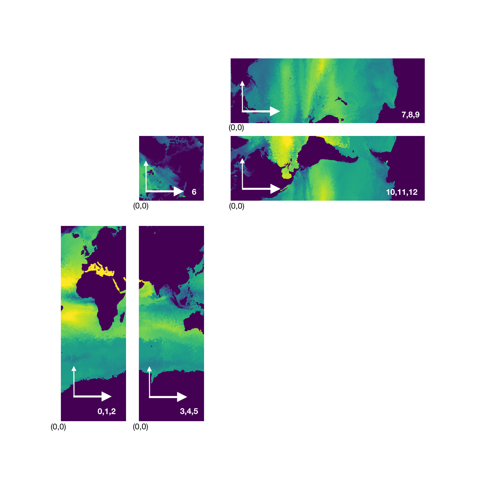

# Data locations on NAS

## Raw data on NAS
- Atmospheric data:
/nobackupp17/dmenemen/DYAMOND/c1440_llc2160/holding
- Ocean data:
/nobackupp17/dmenemen/DYAMOND/c1440_llc2160/mit_output/
- LLC4320 data:
I think that the best approach will be to retrieve that data using our current data extraction pipeline.
You’ll have to write out the data files, but you’ll have the option to convert in batches and delete the completed timesteps.
On a Pleiades, see:
```
/home4/bcnelson/MITgcm/extract/latest/README.usage
/home4/bcnelson/MITgcm/extract/latest/README.uncompress
```
for instruction and best practices for uncompressing the data back into full llc data files.
Seems like note about striping at the bottom of README.uncompress applies.
The general usage will be:
```
/home4/bcnelson/MITgcm/extract/latest/uncompress4320 timesteps fieldnames
```
Example:
```
/home4/bcnelson/MITgcm/extract/latest/uncompress4320 -L 1 10368-10432 U
```
One thing to note, for llc4320, the timestep labels increase by 144 for each timestep.
This corresponds to a 25 second integration period, 144 periods/hour, they saved out data every hour.
The llc2160 timetseps labels, on the other hand, increase by 80, corresponding to an integration period of 45 seconds.
I believe that if you want 64 timesteps of llc4320, you’ll want to request 10368-19584 (i.e. 10368+144*64).
It looks like timesteps begin at 10368 for llc4320.
I tried the following and it worked:
```
/home4/bcnelson/MITgcm/extract/latest/uncompress4320 -L 1 10368-10432 U
```

## Converted data on NAS
- Atmosphere data(IDX files): 
/nobackupp19/vpascucc/IDX1-files/arco_compressed/atmospheric_data
- Ocean data(IDX files): 
/nobackupp19/vpascucc/IDX1-files/mit_output/ocean_data
- Ocean data(IDX2): 
/nobackupp19/vpascucc/converted_files

- The IDX files mentioned above are in Analysis-Ready, Cloud Optimized (ARCO) formats. The ocean dataset is compressed to ~82TB while converting to IDX. The original raw files for ocean data are over 400TB.

# IDX data

- Atmosphere data 10269 timesteps: 
/nobackupp19/vpascucc/IDX1-files/arco_compressed/atmospheric_data
- Ocean data 10367 timesteps: 
/nobackupp19/vpascucc/IDX1-files/mit_output/ocean_data

# IDX2 data
- LLC2160 10000 time steps without time compression
/nobackupp19/vpascucc/converted_files/vpascucc/llc2160_x_y_depth

- LLC2160 1024 time steps with time compression
/nobackupp19/vpascucc/converted_files/vpascucc/llc2160

- LLC4320 in IDX2 format on CEDMAV (depth 0, separate faces, 64 time steps with time compression)
/usr/sci/cedmav/hello/llc4320

# Data location in Sealstorage: 
## Raw data
-Atmospheric data: s3://utah/nasa/dyamond/netcdf/  endpoint_url: https://maritime.sealstorage.io/api/v0/s3

## Idx data 
- Atmosphere data: s3://utah/nasa/dyamond/idx_arco/  endpoint_url: https://maritime.sealstorage.io/api/v0/s3
- Ocean data: s3://utah/nasa/dyamond/mit_output/ocean_data endpoint_url: https://maritime.sealstorage.io/api/v0/s3

# Data locations on SCI CEDMAV/Atlantis
## Raw data on CEDMAV
- Raw LLC4320 on CEDMAV (fields U, V, about 64 time steps each)
/usr/sci/cedmav/hello/llc4320_raw

- Raw atmosphere data in NetCDF on CEDMAV (field U, 1024 time steps)
/usr/sci/cedmav/hello/atmosphere_nc4

## Converted data on CEDMAV
### IDX data
- Ocean data in IDX format on Atlantis
https://atlantis.sci.utah.edu/mod_visus?dataset=nasa-llc-2160 (dimensions: 8640 * 6480 * 90 depth * 1 time step)
https://atlantis.sci.utah.edu/mod_visus?dataset=nasa-llc-4320 (dimensions: 17280 * 12960 * 90 depth * 1 time step)
https://atlantis.sci.utah.edu/mod_visus?dataset=nasa-llc-4320-64 (dimensions: 17280 * 12960 * 1 depth * 64 time step)
-Atmospheric data in IDX  format 
http://atlantis.sci.utah.edu/mod_visus?dataset=nasa-DYAMOND-atmospheric-face_1_depth_52_time_1024 (change face value as required: face_2_, face_3_,...)

- LLC4320 in IDX format on CEDMAV (depth 0 only, 64 time steps)
/usr/sci/cedmav/hello/llc4320_64_idx

### IDX2 data
- LLC2160 in IDX2 format on CEDMAV (field U, face 0, 1024 time steps with time compression)
/usr/sci/cedmav/hello/llc2160

- LLC4320 in IDX2 format on CEDMAV (depth 0, separate faces, 64 time steps with time compression)
/usr/sci/cedmav/hello/llc4320

- Atmosphere in IDX2 format on CEDMAV (field U, 1024 time steps with time compression)
/usr/sci/cedmav/hello/atmosphere

# Data description
The diagram shows the 6 facets of the cubed sphere, with the facets numbered in the order that they are in the file.
Each facet has two arrows starting from the same location.
The double-lined arrow shows the direction of the fastest-varying dimension, and the single-lined arrow shows the direction of the more slowly varying dimension.
Each corner has 3 bits of information.
Taking the upper left corner of the 0 facet as an example, the C labels the cube vertex (the labeling is arbitrary).
The “35 305” is the lat-lon of the vertex; this value shown once per vertex.
The “1 0” gives an abbreviation of the computational coordinate of that vertex in that facet’s data.
A small diagram in the upper right expands that two-digit value to the actual coordinate, indicating that “1 0” corresponds to 1439, 0.
The six facets are stored as one 2D array in the HDF5/nc4 files, in the order shown.
The first part of each coordinate will have to be adjusted to pick out the facet in the 2D array.
The non-adjacent facets have arrows showing adjacencies.

One important thing to note, you may have noticed an inconsistency (appearing as an edge along ~140° E longitude – see attached) when stitching the U faces together. This is correct! Or rather, a feature of the simulation 😊
To show the U field (east-west) correctly, faces 3 and 4  (i.e. the two columns on the right) need to be swapped with faces 3 and 4 of the V field (north-south velocity). To show the V field correctly, faces 3 and 4 need to be swapped with faces 3 and 4 of the U field with inverted values. Happy to discuss this more when the time comes, but I didn’t want the edge to throw you for a loop.

Refer to the following diagrams on how the faces fit together.




# Small sample data

https://data.nas.nasa.gov/viz/vizdata/nmccurdy/vpascucci/data

In it you’ll find two subdirectories containing the following files:

**DYAMOND_c1440_llc2160/U.0000817920.data**
-- a single timestep of MITgcm 2160 lat-lon-cap simulation output containing values for the field ‘U’ (east-west ocean velocity).
Note that these data are big endian (F32BE). In python, the following:
	_raw = np.fromfile(_filename,np.dtype('>f'))
	_data = np.reshape(_raw,(90,13*2160*2160))
will give you 90 levels, each level containing 13, 2160x2160 facets. I can pass along a diagram of how these facets fit together if it would be useful.
As a reference, here’s a vis showing level 0 (sea surface eastward ocean velocity), projected to a lat-lon grid.
https://data.nas.nasa.gov/viz/vizdata/DYAMOND_c1440_llc2160/MITgcm/mp4/HD_latlon_SSU.mp4

**DYAMOND_c1440_llc2160/DYAMOND_c1440_llc2160.inst_01hr_3d_U_Mv.20210320_2100z.nc4**
-- the same timestep of GEOS5 1440 cubed-sphere simulation output containing values for the field ‘U’ (east-west wind velocity).
These data are little endian (F32LE). 52 levels, each level containing 6, 1440x1440 facets – again, happy to pass along a diagram of how these fit together if that would be useful.
As a reference, here’s a vis showing level 51 (sea surface eastward wind velocity) projected to a lat-lon grid.
https://data.nas.nasa.gov/viz/vizdata/DYAMOND_c1440_llc2160/GEOS/mp4/HD_latlon_U.mp4

**llc_4320/0000080208_U.data**
-- a single timestep of  MITgcm 4320 lat-lon-cap simulation output containing values for the field ‘U’ (east-west ocean velocity).              Same notes as for the llc2160 output, but 4320 resolution!
A reference visualization can be found here: https://data.nas.nasa.gov/viz/vizdata/llc4320/index.html

As mentioned in the last meeting, if you would like to start exploring a sample of the ECCO data while the NAS accounts are being set up, the data are available via the NAS data portal:
https://data.nas.nasa.gov/ecco/
Data for the ECCO project’s 1/48th degree MITgcm Simulation (llc_4320), which we’ve been discussing, are available here:
https://data.nas.nasa.gov/ecco/data.php?dir=/eccodata/llc_4320

Along with documentation:
https://xmitgcm.readthedocs.io/en/latest/llcreader.html

And you can browse visualizations of the 1/48th degree MITgcm Simulation here:
https://data.nas.nasa.gov/viz/vizdata/llc4320/index.html